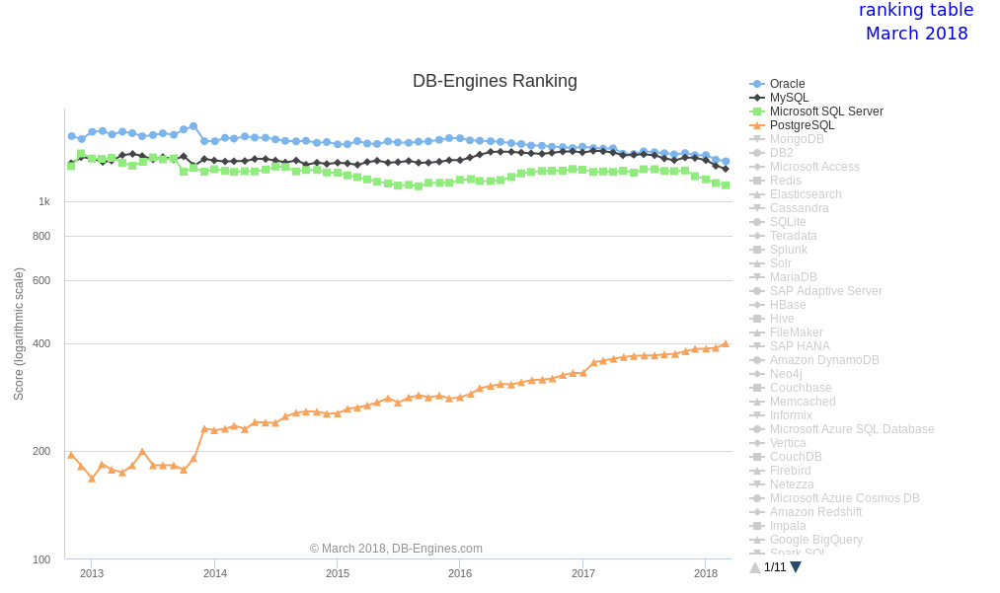
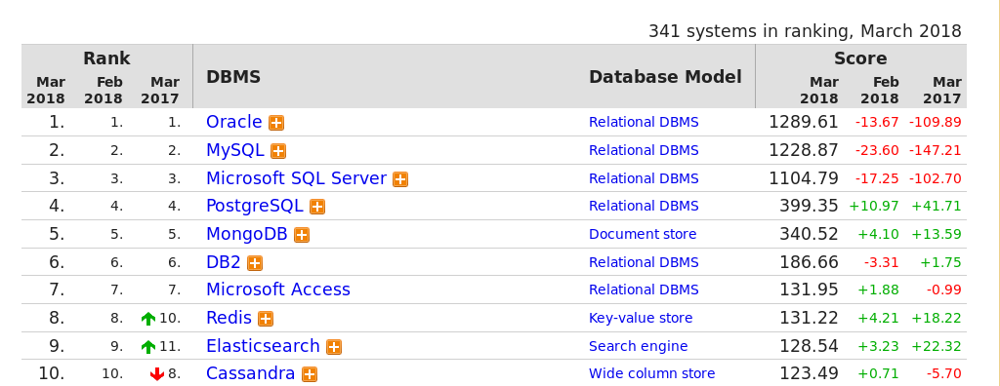
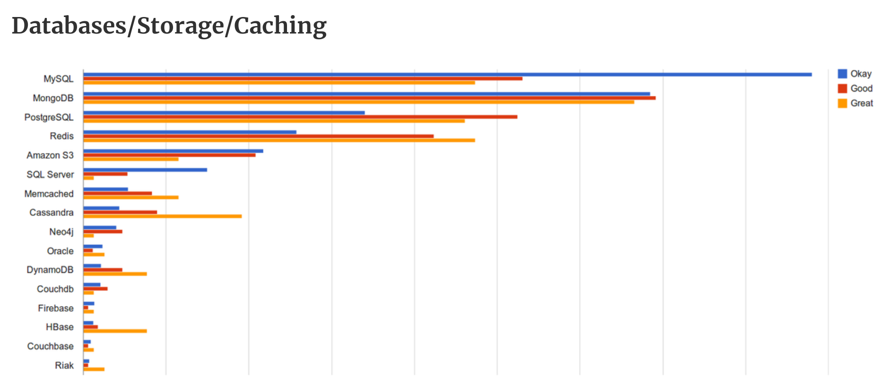
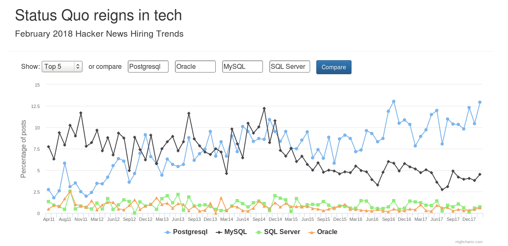

# PostgreSQL

## Popularity

While picking a technology shouldn't depend on the result of any
popularity contest there is some benefit to knowing whether a
technology has been/is being adopted by others (or not).

Given that any attempt to quantify the popularity of anything IT
related, and that any results published along those lines should be
taken with a suitable sized grain of salt, the results can still be
interesting.

----

### Stackoverflow

According to
[Stackoverflow](https://insights.stackoverflow.com/survey/2018/) in
their 2018 survey, PostgreSQL is the third most popular database for
developers, the second most loved (behind Redis), and the third most
wanted (behind MongoDB and Elasticsearch). Interestingly, Oracle shows
up as the second most dreaded database.

----

### DB-Engines

According to [db-engines.com](https://db-engines.com/en/ranking),
PostgreSQL is the 4th most popular database behind Oracle, MySQL, and
Microsoft SQL Server. However, looking at their data, PostgreSQL is
consistently (and reasonably rapidly) gaining ground while the top
three are slowly losing ground. If the trend lines are an accurate
indication, and the current trend continues, then it isn't unreasonable
to suggest that PostgreSQL will be as popular as any of the current
top-three by 2023/2024 (which doesn't seem to be all that long in
database terms).

----

### Coding VC

This is interesting in that [Coding
VC](https://codingvc.com/which-technologies-do-startups-use-an-exploration-of-angellist-data)
attempts to determine/show the technology stack being used by startups.
Of additional interest (to me at least) is the ratio of
Okay-to-Good-to-Great startups compared to MySQL and MS SQL Server (not
known is how an ok startup is distinguished from a good or great
startup).

----

### Hacker News

Looking at the hiring trend data at
[Hacker News Hiring Trends](https://www.hntrends.com/2018/feb-status-quo-reigns-tech.html?compare1=Postgresql&compare2=Oracle&compare3=MySQL&compare4=SQL+Server)
the future also looks pretty bright for PostgreSQL.

----

### Links

 * https://codingvc.com/which-technologies-do-startups-use-an-exploration-of-angellist-data
 * https://db-engines.com/en/ranking
 * https://insights.stackoverflow.com/survey/2018/
 * https://www.bloomberg.com/news/articles/2015-06-11/oracle-sales-eroded-as-startups-embrace-souped-up-free-software
 * https://www.forbes.com/sites/benkerschberg/2016/03/08/how-postgres-and-open-source-are-disrupting-the-market-for-database-management-systems/
 * https://www.hntrends.com/2018/feb-status-quo-reigns-tech.html?compare1=Postgresql&compare2=Oracle&compare3=MySQL&compare4=SQL+Server
 * https://www.infoworld.com/article/2916057/open-source-software/open-source-threatens-to-eat-the-database-market.html
 * https://www.infoworld.com/article/2928610/database/why-your-next-database-will-be-open-source.html?nsdr=true
 * https://www.infoworld.com/article/3252244/database/oracles-cloud-bravado-masks-its-database-despair.html
 * https://www.infoworld.com/article/3261571/database/how-postgresql-just-might-replace-your-oracle-database.html
 * https://www.techrepublic.com/article/oracles-biggest-database-foe-could-it-be-postgres/
